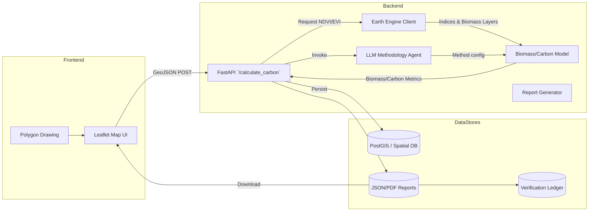

# CarbonEye Agent — System Diagram

**Data flow summary**

1. Users draw/upload polygons in the Leaflet UI and submit GeoJSON to the API.
2. FastAPI validates geometry, computes area, and coordinates Earth Engine + ML calls.
3. The LLM agent selects methodologies, datasets, and conversion factors.
4. Biomass model converts NDVI/EVI + auxiliary biomass data into carbon stock and CO₂e.
5. Results are cached, persisted, and available via JSON/PDF reports, ready for carbon market verification.
